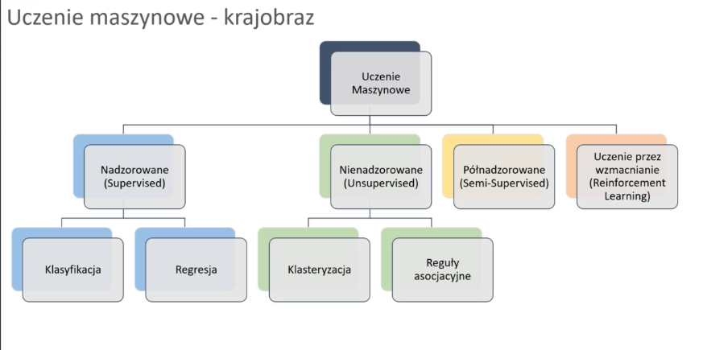
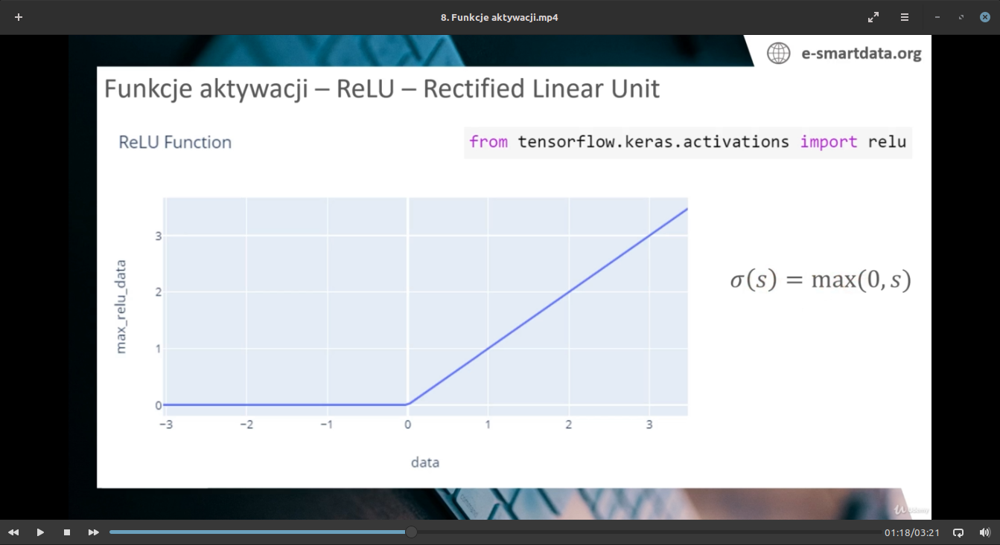
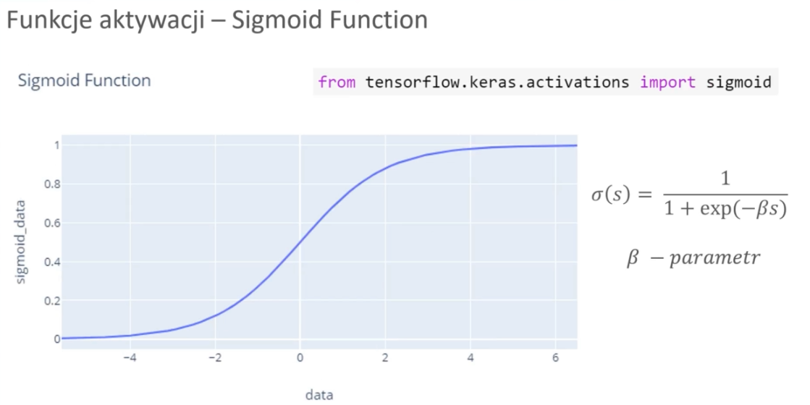
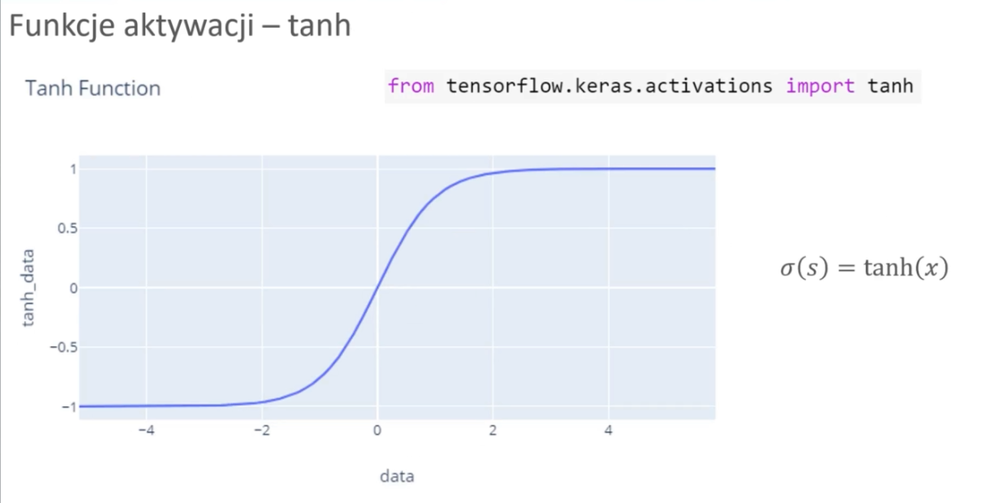

# Uczenie maszynowe.

Algorytmy uczenia maszynowego, operują naszymi danymi tak, aby można było je łatwiej sklasyfikować.

Na przykład za pomocą transformacji osi współrzędnych.

> (25, rys 1.4)
>

propagacja gradientu- propagować to inaczej rozprzestrzeniać.  propagacja gradientu czyli to dzielenie na zbiory?

sprzezenie zwrotne- jest to informacja o rezultacie jakieś akcji danego układu, która trafia spowrotem do tego układu i wpływa na jego dzialanie. Rozróżniamy s.z. dodatnie i ujemne. dodatnie napędza układ, ujemne go stabilizuje. 

zwrost wykładniczy- np do kwadratu.



**Learning rate (wskaźnik uczenia)**- 

odpowiada za szybkosc dopasowania naszego modelu. Jeżeli jest zamały to rezultatem tego, jest że nasz model będzie się bardzo długo uczył. Jeżeli jest za duży, model może się nie nauczyć.

**Wagi**- element sieci który chcemy dopasowywać podczas trenowania.

**Funkcja aktywacji**- pozwala uczyc sieci  nieliniowych problemów. (na przykład spiralnych, xor itp)

**Funkcja straty**- sprawdza jak bardo wygenerowane przez siec dane odbiegaja od danych oczekiwanych. Inaczej funkcja celu.

**Optymalizator**- Dostraja wagi.

**Tensor**- Uogólnienie macierzy. Zwykle w wyszych wymiarach.

**Skalar** = wartość numeryczna, jednoelementowa.

Rozmiar macierzy- (rzędy, kolumny)

### Funkcje aktywacji

**reLU**- Dla wartości dodatnich, zwraca podaną wartość, dla ujemnych zwraca zero.


```python
from tensorflow.keras.activations import relu
```



$$
σ(s) = max(0,s)
$$


**Sigmoid**- Dość ważna funkcja, pozwala generować wartości od zera do jeden. Stosowana na ostatnich warstwach sieci neuronowej, gdyż łatwo dzieli na klasy.


```python
from tensorflow.keras.activations import sigmoid
```




$$
\sigma(s) =\frac {1} {1+exp(\beta s)}
\\
\beta - parametr
$$

$$
f(x) = \frac{1}{1 + e^{-x}}
$$

**Tanh** *(tangens hiperboliczny)*- Od sigmoida rózni się tym, że zwraca wartości od -1 do 1.  Czasem daje lepsze rezultaty niż sigmoid.

```python
from tensorflow.keras.activations import tahm
```



$$
\sigma (s) = tahn(x)
$$

$$
tanh (x) = \frac{e^{x} - e^{-x}}{e^{x} + e^{-x}}
$$

**Softmax**- Pomocna z klasyfikacją, wyniki sumują się do jedynki.


$$
S(x_i)=\frac{e^{x_{i}}}{\sum_{j=1}^{N}e^{x_j}},\ \ dla\ i = 1,...,N
$$
$$
S(x_1)=\frac{e^{x_{1}}}{\sum_{j=1}^{N}e^{x_j}}
$$

### Funkcje straty- klasyfikacja

**Binary cross entropy**- tak, czy nie. Czy klient zostanie, czy odejdzie.

```python
from tensorflow.keras.losses import binary_crossentropy
binary_crossentropy(y_true, y_pred)
```

**Categorical cross entropy**- wiecej niz dwie klasy. np kolor kwiatka, gatunek zwierzęcia, rodzaj ubrania itd.

```python
from tensorflow.keras.losses import categorical_crossentropy
categorical_crossentropy(y_true, y_pred)
```

Przyjmują wartości prawdziwe dla danego casu, i nasze przewidywania.

**Regresja**- Uśredniamy błąd naszego przybliżenia.

MAE

```python
from tensorflow.keras.losses import mean_absolute_error
mean_absoulte_error(y_true, y_pred)
```

MSE

```python
from tensorflow.keras.losses import mean_squared_error
mean_squared_error(y_true, y_pred)
```

Dązymy do minimalizacji metryk.

### Metryki

- Accuracy
- Macierze konfuzji/ pomyłek
- Krzywa ROC
- Raport klasyfikacji

###  Regresja

- MEA- Mean Absolute Error
- MSE - Mean Squared Error
- RMSE - Root Mean Squared Error
- R2 score

$$
Accuracy = \frac {correct\ predictions} {total\ predictions} * 100
$$

