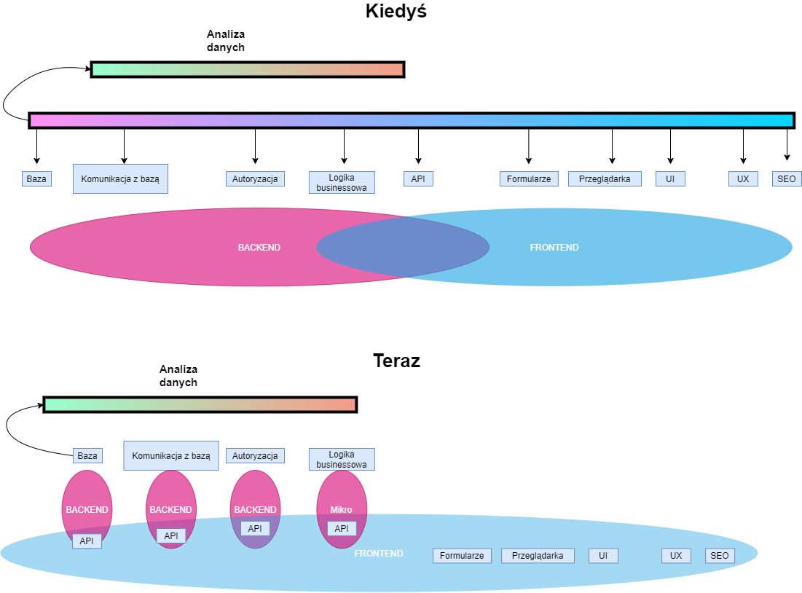

# Szkolenie

### Ogólnie

##### Co będzie potrzebne

- Vsc / Webstorm (preferowany Webstorm)
- Node.js LTS (na oficjalnej stronie jest instalka do maka również)
- Laptop

- [ ]  Ogólnie
	- [ ]  Co i jak?
		- [ ]  Jak rozmawiają ze sobą komputery
		- [ ]  Co to jest HTTP i inne protokoły wymiany danych
		- [ ]  Co to są monolitowe systemy
		- [ ]  Po co i dlaczego
		- [ ]  Wady i zalety
		- [ ]  Mikro serwisy
			- [ ]  Po co i dlaczego
		- [ ]  Wady i zalety
		- [ ]  JSON, XML, YML, MD
	- [ ]  **Backend**
		- [ ]  Rola
		- [ ]  Zadania
		- [ ] Stanowość
		- [ ]  Api 
			- [ ]  Endpointy i filtrowanie
		- [ ]  Autoryzacja vs Identyfikacja (Authentication and Authorization)
		- [ ]  ORM, DTO, bazy danych co i jak.
		- [ ]  Języki
	- [ ] **Frontend**
		- [ ] One to rule them all
		- [ ] Historia JS
		- [ ] UX/ UI
  	- [ ] Czy front end to programowanie?
    - [ ] Technologie frontendowe, React, Angular, Vue, GraphQL
    - [ ] Korzystanie z mikroserwisów.
    

### Kodzenie

- [ ]  Kodzenie
	- [ ]  Backend
		- [ ]  Strapi i podstawowe dane
	- [ ]  Frontend
		- [ ]  HTML
		- [ ]  Css
		- [ ]  JS
		- [ ]  React 
		- [ ]  Gatsby
		- [ ]  GraphQL

------

Linki

[Api](https://jsonplaceholder.typicode.com/)

[Postwoman](https://postwoman.io/)

[GraphQL](https://swapi.graph.cool/)

