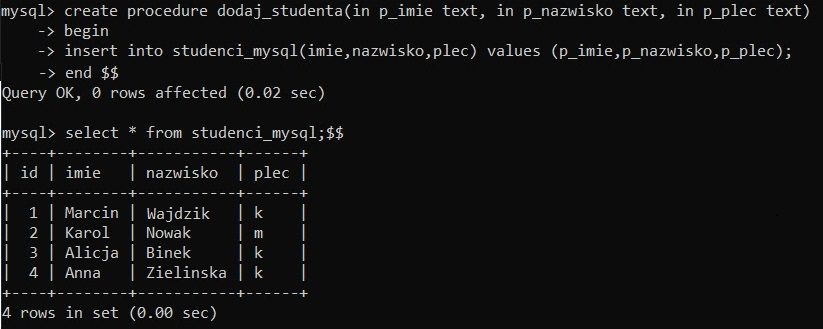

> zadanie powtórkowe

```mysql
create table osoby(
id int identity primary key,
nazwisko varchar(MAX),
pesel varchar(11)
)
create function sprawdz_pesel(@pesel varchar(11))
returns bit
begin
declare @wynik bit
set @wynik=0
if(len(@pesel)<>11)
set @wynik = 0
if(isnumeric(@pesel)!=1)
set @wynik = 0
declare @suma int
set @suma=(select cast(substring(@pesel,1,1) as int) * 1 +
cast(substring(@pesel,2,1) as int) * 3 +
cast(substring(@pesel,3,1) as int) * 7 +
cast(substring(@pesel,4,1) as int) * 9 +
cast(substring(@pesel,5,1) as int) * 1 +
cast(substring(@pesel,6,1) as int) * 3 +
cast(substring(@pesel,7,1) as int) * 7 +
cast(substring(@pesel,8,1) as int) * 9 +
cast(substring(@pesel,9,1) as int) * 1 +
cast(substring(@pesel,10,1) as int) * 3 )
declare @modulo int
set @modulo = @suma %10
if(cast (substring(@pesel,11,1) as int) = 10-@modulo)
set @wynik=1
return @wynik
end
create trigger czy_pesel
on osoby
for insert
as
if(select count(*) from inserted i where dbo.sprawdz_pesel(i.pesel) =
0) > 0
begin
print'niepoprawny pesel'
rollback
end
```


> zadanie 201
```mysql
use wajdzikma;
CREATE TABLE studenci_zmiany (
id INT AUTO_INCREMENT PRIMARY KEY,
id_studenta INT NOT NULL,
nazwisko VARCHAR(50) NOT NULL,
data_zmiany DATETIME DEFAULT NULL,
operacja VARCHAR(50) DEFAULT NULL
);
CREATE TRIGGER zmiany_studenta_update
BEFORE UPDATE ON studenci_mysql
FOR EACH ROW
INSERT INTO studenci_zmiany (operacja, id_studenta, nazwisko,
data_zmiany) values
('update', OLD.id, OLD.nazwisko, NOW());
CREATE TRIGGER zmiany_studenta_insert
BEFORE INSERT ON studenci_mysql
FOR EACH ROW
INSERT INTO studenci_zmiany (operacja, id_studenta, nazwisko,
data_zmiany) values
('insert', new.id, new.nazwisko, NOW());
CREATE TRIGGER zmiany_studenta_delete
BEFORE DELETE ON studenci_mysql
FOR EACH ROW
INSERT INTO studenci_zmiany (operacja, id_studenta, nazwisko,
data_zmiany) values
('delete', OLD.id, OLD.nazwisko, NOW());
```


> zadanie 202

```mysql
CREATE TABLE samochody (
id INT AUTO_INCREMENT PRIMARY KEY,
marka VARCHAR(50) NOT NULL,
model VARCHAR(50) NOT NULL,
kolor VARCHAR(50) NOT NULL,
rok_produkcji int NOT NULL,
przebieg int NOT NULL,
uwagi text DEFAULT NULL
);
```
> zadanie 202a
> 
```mysql
create trigger nie_marka
before insert on samochody
for each row
begin
if (new.marka="audi")
then
SIGNAL sqlstate '45001' set message_text = "to nie moze byc
audi";
end if;
end;
#insert into samochody(marka,model,kolor,rok_produkcji,przebieg)
values ("audi","a","a",1,1);
```

> zadanie 202b
```mysql
create trigger nie_marka_kolor
before insert on samochody
for each row
begin
if (new.marka="BMW" and new.kolor="zielony")
then
SIGNAL sqlstate '45001' set message_text = "to nie moze byc
bmw zielone";
end if;
end;
#insert into samochody(marka,model,kolor,rok_produkcji,przebieg)
values ("BMW","a","zielony",1,1);
```
> zadanie 202c
```mysql
create trigger przebieg
before insert on samochody
for each row
begin
if (new.przebieg < ((year(now()) - new.rok_produkcji) *
10000))
then
set new.uwagi = "za niski brzebieg";
end if;
end;
#insert into samochody(marka,model,kolor,rok_produkcji,przebieg)
values ("BMW","a","zielony",1999,10);
```




> zadanie 203
```mysql

CREATE TABLE studenci (
id INT AUTO_INCREMENT PRIMARY KEY,
imie VARCHAR(50) NOT NULL,
nazwisko VARCHAR(50) NOT NULL,
plec VARCHAR(1) NOT NULL,
pesel VARCHAR(11) NOT NULL
);
insert into studenci(imie,nazwisko,plec,pesel) values
('a','a','a','96030204412')
create trigger pesel_check
before insert on studenci
for each row
begin
set @wynik=0;

 if (length(new.pesel) <= 11)
then set @wynik = 0;
end if;

 #number check
 
 if (new.pesel > 0)
then set @wynik = 0;
end if;

 set @suma=(select cast(substring(@pesel,1,1) as UNSIGNED) * 1 +
cast(substring(@pesel,2,1) as UNSIGNED) * 3 +
cast(substring(@pesel,3,1) as UNSIGNED) * 7 +
cast(substring(@pesel,4,1) as UNSIGNED) * 9 +
cast(substring(@pesel,5,1) as UNSIGNED) * 1 +
cast(substring(@pesel,6,1) as UNSIGNED) * 3 +
cast(substring(@pesel,7,1) as UNSIGNED) * 7 +
cast(substring(@pesel,8,1) as UNSIGNED) * 9 +
cast(substring(@pesel,9,1) as UNSIGNED) * 1 +
cast(substring(@pesel,10,1) as UNSIGNED) * 3 );

set @modulo = @suma %10;
 if(cast(substring(new.pesel,11,1) as UNSIGNED) = (10-@modulo))
then set @wynik=1;
end if;

 if(@wynik = 0)
then SIGNAL sqlstate '45001' set message_text = "zly
pesel";
end if;
end;
```


