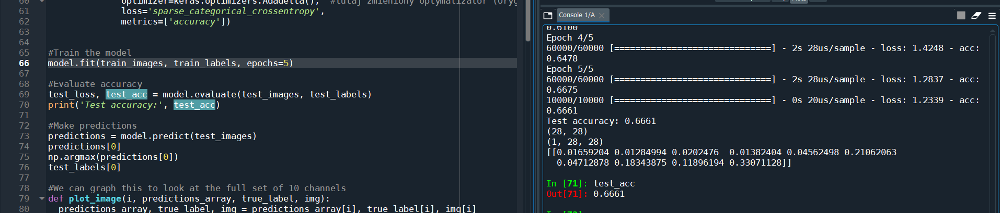
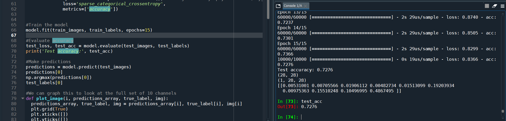
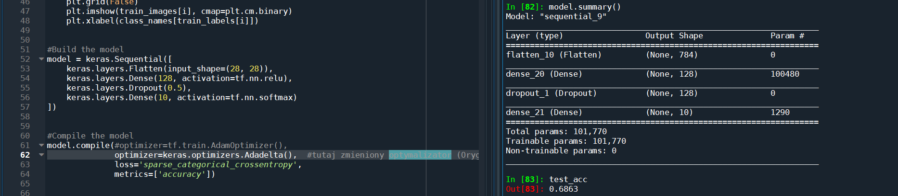
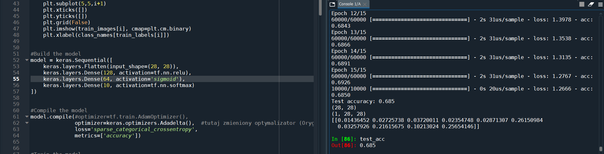
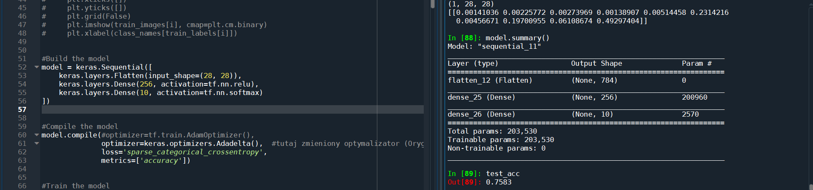
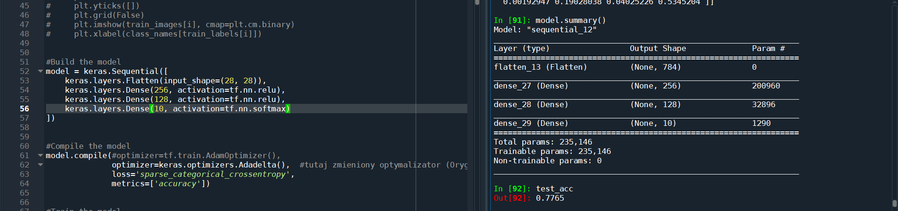
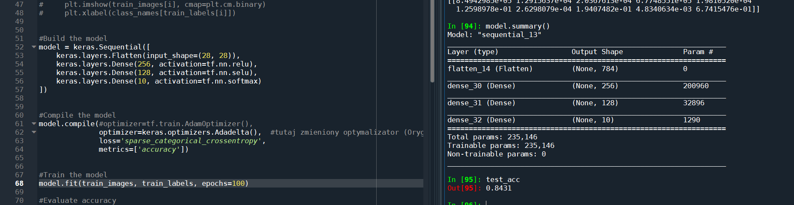

### Domyślne ustawienie: 

> test_acc = 0.6661

### Zwiększenie ilości epoch do 15:

> Poprawa o około 6 pkt procentowych.

### dodanie warstwy Dropout

> Skutkowalo pogorszeniem o około 4 pkt procentowe. 

### Dodanie warstwy dense z actywatorem sigmoid pogorszylo rezultaty. 

### Zwiększenie ilości neuronów o 128 poprawiło wyniki. 

> Test acc 0.7583

### Dodanie dodatkowej warstwy z aktywatorem relu poprawiło dokładność sieci.

> test acc 0.7765

### Najlepsze wyniki zostały osiągnięte na 100 warstwach.

