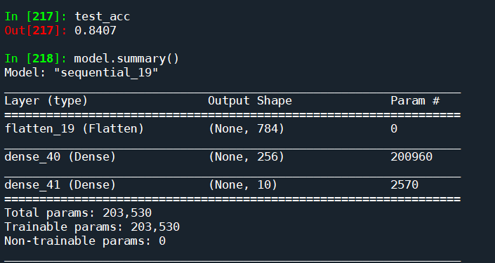

Rozwiazanie 5.1

```python
from PIL import Image

# TensorFlow and tf.keras
import tensorflow as tf
from tensorflow import keras

# Helper libraries
import numpy as np
import matplotlib.pyplot as plt

print(tf.__version__)

fashion_mnist = keras.datasets.fashion_mnist

(train_images, train_labels), (test_images, test_labels) = fashion_mnist.load_data()

class_names = ['T-shirt/top', 'Trouser', 'Pullover', 'Dress', 'Coat', 
               'Sandal', 'Shirt', 'Sneaker', 'Bag', 'Ankle boot']

epoki = 15;


#Explore the data
train_images.shape
len(train_labels)
train_labels
test_images.shape
len(test_labels)


#Preprocess the data
plt.figure()
plt.imshow(train_images[0])
plt.colorbar()
plt.grid(False)

plt.show()

train_images = train_images / 255.0
test_images = test_images / 255.0

# Plot images
plt.figure(figsize=(10,10))
for i in range(25):
    plt.subplot(5,5,i+1)
    plt.xticks([])
    plt.yticks([])
    plt.grid(False)
    plt.imshow(train_images[i], cmap=plt.cm.binary)
    plt.xlabel(class_names[train_labels[i]])


#Build the model
model = keras.Sequential([
    keras.layers.Flatten(input_shape=(28, 28)),
    keras.layers.Dense(256, activation=tf.nn.relu),
    keras.layers.Dense(10, activation=tf.nn.softmax)
])


#Compile the model
model.compile(#optimizer=tf.train.AdamOptimizer(),
              optimizer=keras.optimizers.Adadelta(),  #tutaj zmieniony optymalizator (Oryginalny Adam nie działa w tej wersji)
              loss='sparse_categorical_crossentropy',
              metrics=['accuracy'])


#Train the model
model.fit(train_images, train_labels, epochs=epoki)

#Evaluate accuracy
test_loss, test_acc = model.evaluate(test_images, test_labels)
print('Test accuracy:', test_acc)

#Make predictions
predictions = model.predict(test_images)
predictions[0]
np.argmax(predictions[0])
test_labels[0]

#We can graph this to look at the full set of 10 channels
def plot_image(i, predictions_array, true_label, img):
  predictions_array, true_label, img = predictions_array[i], true_label[i], img[i]
  plt.grid(False)
  plt.xticks([])
  plt.yticks([])
  
  plt.imshow(img, cmap=plt.cm.binary)

  predicted_label = np.argmax(predictions_array)
  if predicted_label == true_label:
    color = 'blue'
  else:
    color = 'red'
  
  plt.xlabel("{} {:2.0f}% ({})".format(class_names[predicted_label],
                                100*np.max(predictions_array),
                                class_names[true_label]),
                                color=color)
  

def plot_value_array(i, predictions_array, true_label):
  predictions_array, true_label = predictions_array[i], true_label[i]
  plt.grid(False)
  plt.xticks([])
  plt.yticks([])
  thisplot = plt.bar(range(10), predictions_array, color="#777777")
  plt.ylim([0, 1]) 
  predicted_label = np.argmax(predictions_array)
 
  thisplot[predicted_label].set_color('red')
  thisplot[true_label].set_color('blue')

#Let's look at the 0th image, predictions, and prediction array.
i = 0
plt.figure(figsize=(6,3))
plt.subplot(1,2,1)
plot_image(i, predictions, test_labels, test_images)
plt.subplot(1,2,2)
plot_value_array(i, predictions,  test_labels)

i = 12
plt.figure(figsize=(6,3))
plt.subplot(1,2,1)
plot_image(i, predictions, test_labels, test_images)
plt.subplot(1,2,2)
plot_value_array(i, predictions,  test_labels)


# Plot the first X test images, their predicted label, and the true label
# Color correct predictions in blue, incorrect predictions in red
num_rows = 5
num_cols = 3
num_images = num_rows*num_cols
plt.figure(figsize=(2*2*num_cols, 2*num_rows))
for i in range(num_images):
  plt.subplot(num_rows, 2*num_cols, 2*i+1)
  plot_image(i, predictions, test_labels, test_images)
  plt.subplot(num_rows, 2*num_cols, 2*i+2)
  plot_value_array(i, predictions, test_labels)

# Grab an image from the test dataset
img = test_images[0]
# print(img.shape)

# Add the image to a batch where it's the only member.
img = (np.expand_dims(img,0))
# print(img.shape)

#Now predict the image:
predictions_single = model.predict(img)
# print(predictions_single)
plot_value_array(0, predictions_single, test_labels)
_ = plt.xticks(range(10), class_names, rotation=45)


np.argmax(predictions_single[0])


########################################## Moj kod

class_names = ['T-shirt/top', 'Trouser', 'Pullover', 'Dress', 'Coat', 
               'Sandal', 'Shirt', 'Sneaker', 'Bag', 'Ankle boot']

def img_converter(img_to_convert_path):
    img = Image.open(img_to_convert_path)
    (img_width, img_height) = (28, 28)
    img_resized = img.resize((img_width,img_height))
    img_gray = img_resized.convert("L")
    np_img = np.array(img_gray, dtype="float") / 255.0
    # np.array(data, dtype="float") / 255.0
    return np_img

def predict_and_display_single_image(np_image):
    np_image = (np.expand_dims(np_image,0))
    my_predictions_single = model.predict(np_image)
    # print(my_predictions_single)
    plot_value_array(0, my_predictions_single, test_labels)
    _ = plt.xticks(range(10), class_names, rotation=45)
    np.argmax(my_predictions_single[0])
    

tshirt = img_converter("imgs/raw/tshirt-white.png")
shoe_flat = img_converter("imgs/raw/shoe.png")
dress = img_converter("imgs/raw/dress.png")

(my_images, my_labels) = (np.array([tshirt, shoe_flat, dress])),(np.array([0,7,3], dtype="uint8"))

#Pojedyncze zdjecia
predict_and_display_single_image(shoe_flat)
predict_and_display_single_image(dress)
predict_and_display_single_image(tshirt)

# result = model.predict(my_images)
# print(result[0])
# np.argmax(result[0])


############### Rozwiazanie

#We can graph this to look at the full set of 10 channels
def my_plot_image(i, predictions_array, true_label, img):
  predictions_array, true_label, img = predictions_array[i], true_label[i], img[i]
  pred = np.sort(predictions_array)
  plt.grid(False)
  plt.xticks([])
  plt.yticks([])
  plt.imshow(img, cmap=plt.cm.binary)
  predicted_label = np.argmax(predictions_array)
  if predicted_label == true_label:
    color = 'blue'
  else:
    color = 'red'

  idx = (-predictions_array).argsort()[:3]

  string_to_display = f'{class_names[predicted_label]}\
 {"{:.2f}".format(100*np.max(predictions_array))}% \n \
 ({class_names[true_label]})\
    '
  druga_kategoria = f'\n Druga kategoria: {class_names[idx[1]]} {"{:.2f}".format(100*predictions_array[idx[1]])}%'
  trzecia_kategoria = f'\n Trzecia kategoria: {class_names[idx[2]]} {"{:.2f}".format(100*predictions_array[idx[2]])}%'
  
  string_to_display += druga_kategoria
  string_to_display += trzecia_kategoria
  plt.xlabel(string_to_display,color=color)
  
    
my_predictions = model.predict(my_images)   
       
num_rows = 1
num_cols = 3
num_images = num_rows*num_cols
plt.figure(figsize=(2*2*num_cols, 2*num_rows))
for i in range(num_images):
  plt.subplot(num_rows, 2*num_cols, 2*i+1)
  my_plot_image(i, my_predictions , my_labels, my_images)
  plt.subplot(num_rows, 2*num_cols, 2*i+2)
  plot_value_array(i, my_predictions , my_labels)
```

