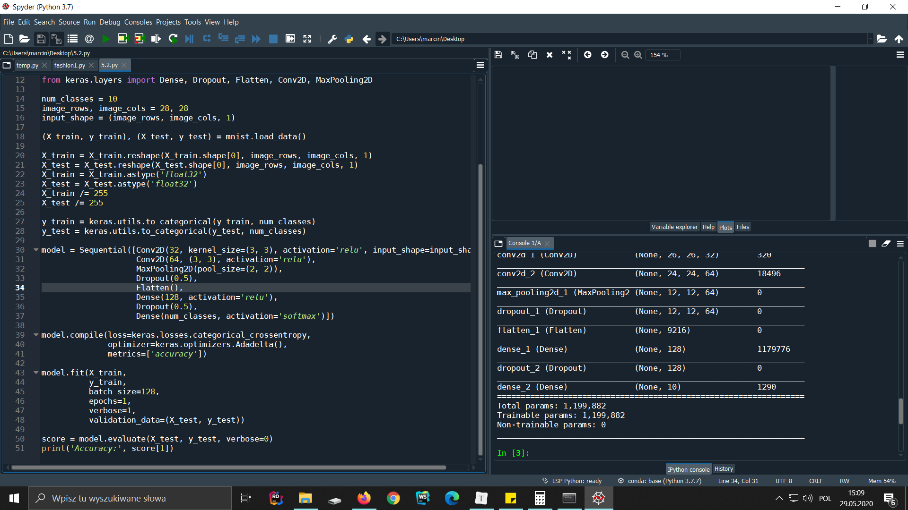
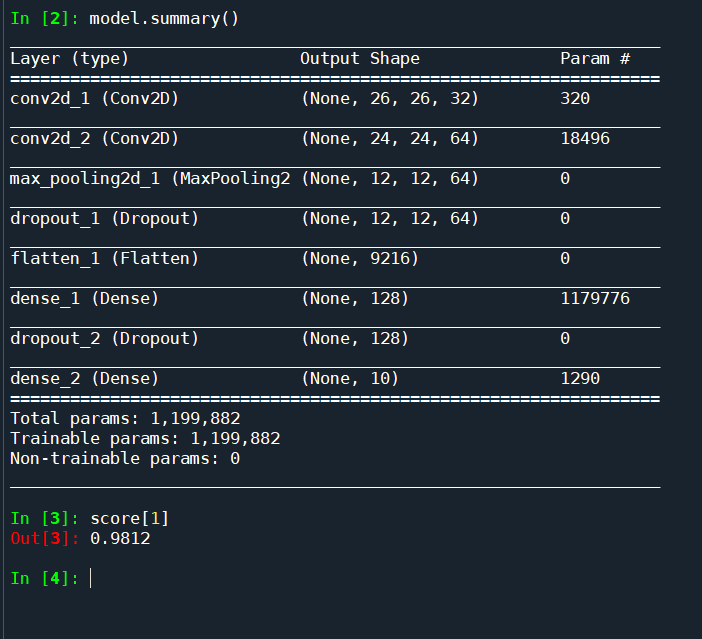
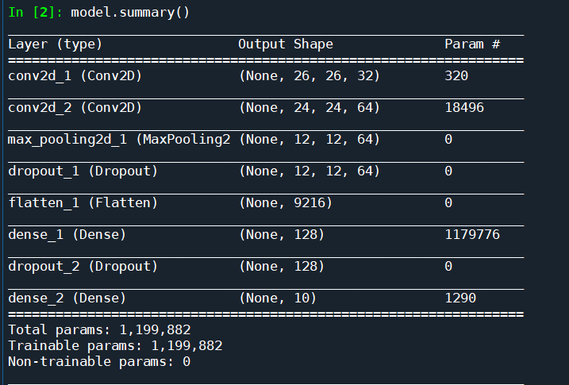
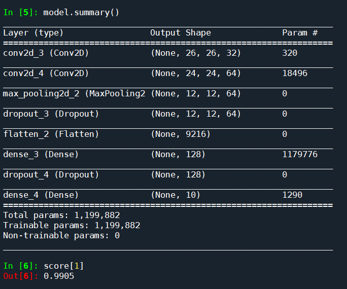
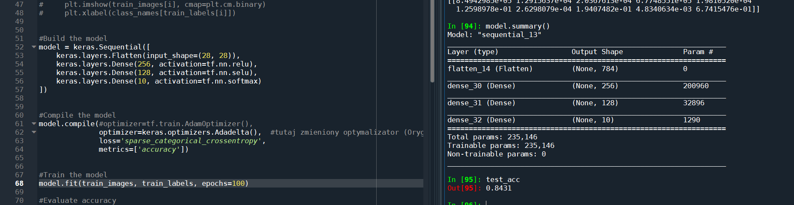
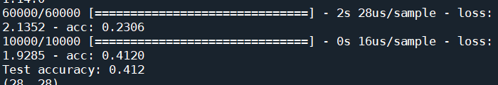
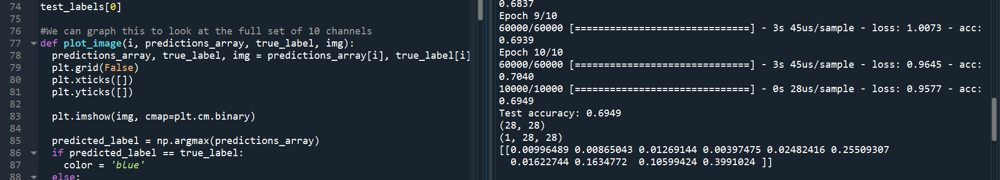
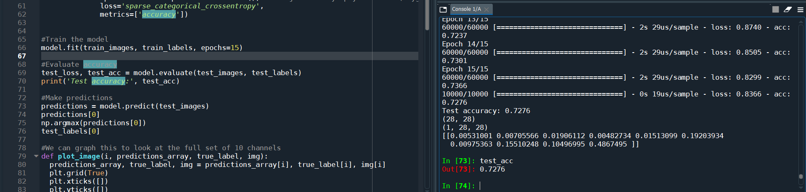
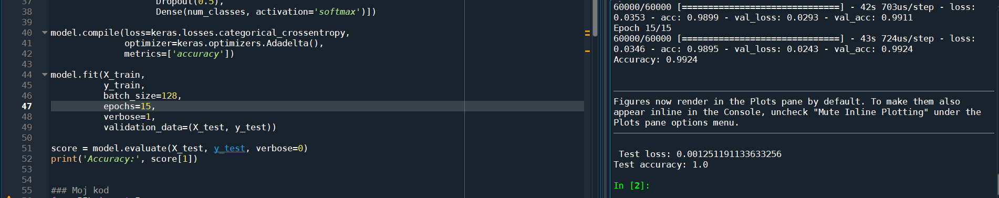

### 5_2.

a) pomyślnie uruchomiłem sieć w wersji konwolucyjnej.

Domyślne wartości:

> accuracy = 0,9812
> batch_size=128,
> epochs=1,

# Konwolucyjne:

### Najlepsza sieć konwoluncyjna

Najlepsze wyniki uzyskałem zwiększając ilość epochs do 15.

> Accuracy: 0.9924
> batch_size=128,
> epochs=15

### top 2.

---

# Gęste:

### Najlepsza sieć gęsta

Najlepsze rezultaty dla modelów z warstwami gęstymi, w moim przypadku wystąpiły przy trenowaniu sieci dla 100 epok i takimi parametrami modelu:

> acc 0,8431

# Bezpośrednie Porównanie

Jako wartość porównawczą wybrałem accuracy danego modelu.

## Dla 1 epoki

**Gęsta**

> acc 0,412

**Splątana**

> acc 0,9812

## Dla 10 epok

**Gęsta**

> acc 0,6949

**Splątana**

> 0,9905

## Dla 15 epok

**Gęsta**

> acc 0,7276

**Splątana**

> acc 0,9924